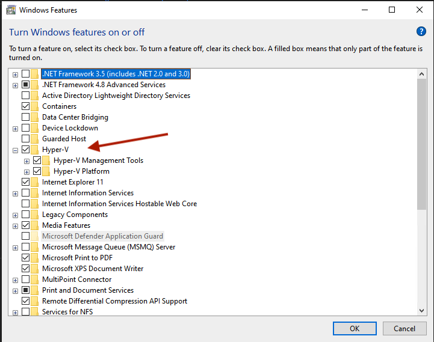

# My Azure Virtual Machine Setup

## Run the following block in an elevated PowerShell console
```javascript
Set-ExecutionPolicy Bypass -Scope Process -Force; 
[System.Net.ServicePointManager]::SecurityProtocol = [System.Net.ServicePointManager]::SecurityProtocol -bor 3072; 
iwr https://community.chocolatey.org/install.ps1 -UseBasicParsing | iex
```

## Chocolatey is ready to use. Run the following to install the essential tools

```
choco install git -y
```

```
choco install vscode -y
```

```
choco install docker-desktop -y
```

## Docker version is important

Yet to find the details of what are the issues with the most recent Docker Desktop Version. But it is better to use 4.6.0 for now.

```
choco install docker-desktop --version=4.6.0 -y
```


## Other useful tools

- TBD

## Turn on Windows Features




## Enable optional featurs on Windows

This will make sure Windows Containers can be enabled on Docker Desktop

```
Enable-WindowsOptionalFeature -Online -FeatureName $("Microsoft-Hyper-V", "Containers") -All
```

## Turn on Options Windows Features

## Must have for VSCode:

- Docker
- ESLint
- Markdown All in One
- markdownlint
- Prettier - Code formatter
- Prettier ESLint
- Stylelint
- Tailwind CSS IntelliSense
- Trailing Spaces
- TypeScript Hero
- YAML